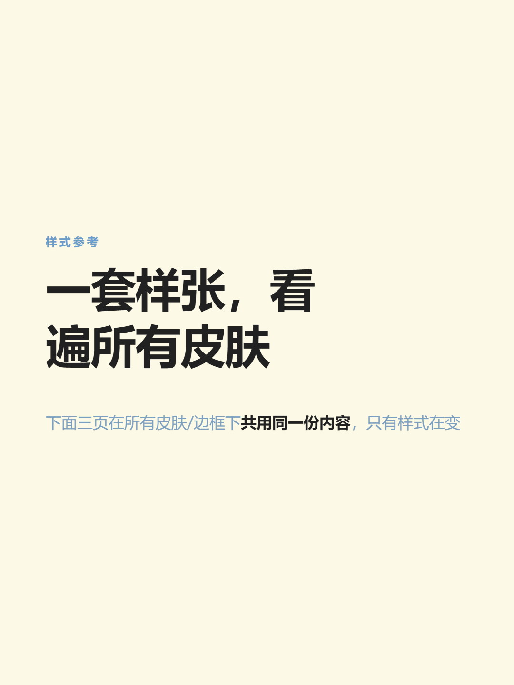
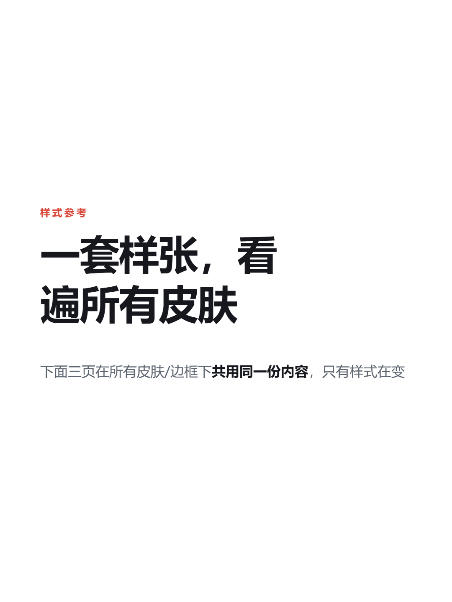
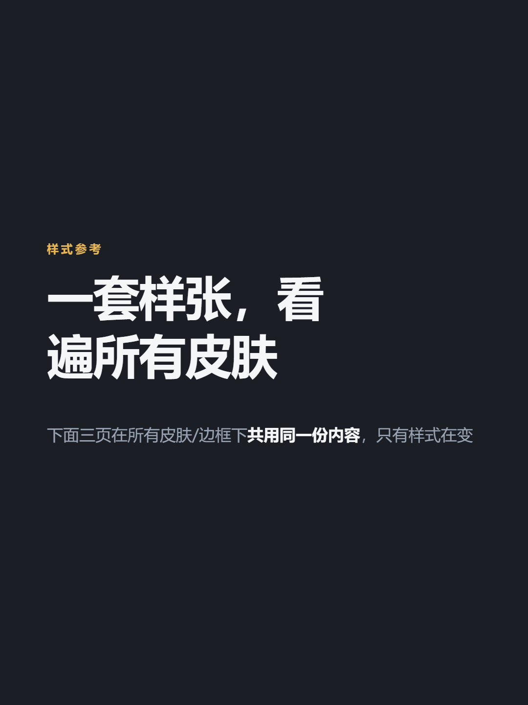
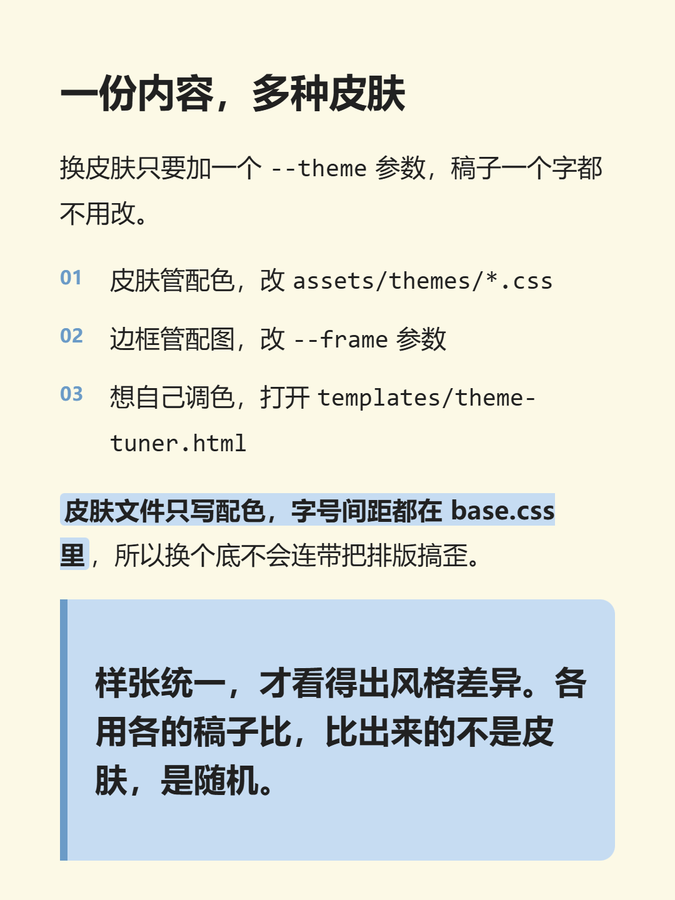
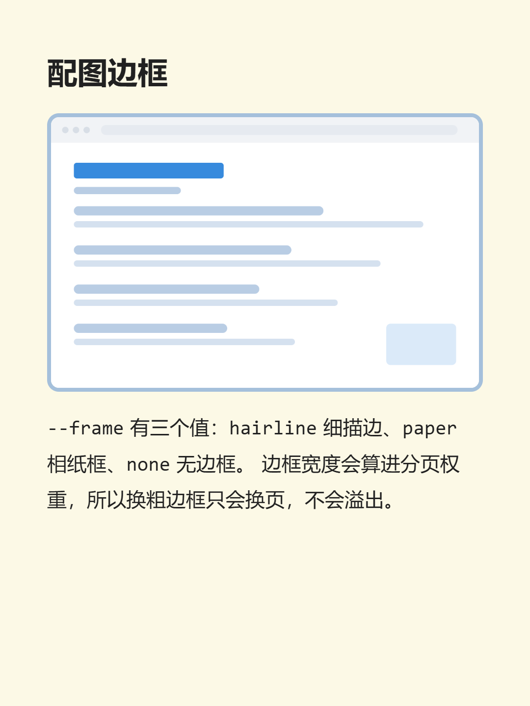

# xhs-card-studio

把一篇 Markdown 稿件变成一套可以直接发小红书的 **3:4 卡片（1080×1440）**。

> 这是给 AI Agent 用的 **Skill**（Agent Skill），不是一个要装一堆依赖的 npm 包。
> 装进你的 agent 之后，你只要说「把这篇文章做成小红书图文」，它就会接手。

<p align="center">
  
  
  
  
</p>

<p align="center"><sub><b>4 套内置皮肤</b> —— 同一份稿件、同一种版式，只有配色在变。</sub></p>

<p align="center">
  
  
</p>

<p align="center"><sub>默认皮肤（奶油蓝）的内容页与配图页。以上全部 1080×1440，由本技能生成。</sub></p>

> 📐 **完整视觉模板总览**：4 套皮肤 × 3 种配图边框 = 12 种组合，全都在
> [`docs/gallery.html`](docs/gallery.html) 里实时渲染（clone 后用浏览器打开；
> 或跑 `node scripts/build-gallery.mjs` 重新生成）。

---

## 它解决什么问题

写好的长文直接发小红书 → 一大坨文字，没人读。
一篇篇手动切图、排版 → 累，而且风格不统一。

这个技能做的是：**稿件进，成套卡片出**，风格固定、分页自动、尺寸合规。

**核心设计：先确认，再出图。**
流程强制三段式 —— 生成 HTML → **你看了点头** → 才渲染 PNG。不会一口气跑完直接把图甩给你。

## 特性

| | |
| --- | --- |
| **智能分页（双轨）** | 自动按卡片实际可用高度切；也可以用 `---`、`#` 标题、手写页码 `1 2 3` 手动控制 |
| **Obsidian 原生支持** | `![[图.png]]` 嵌入、`==高亮==`、手写数字页码都认。附件从稿件目录逐级向上找，笔记在子目录、图在 vault 根也不用挪 |
| **三层样式体系** | `base.css` 结构 + 共用基准值 → `themes/*.css` 只写配色 → `frames/*.css` 配图边框。换皮肤不动结构、不动排版 |
| **4 套内置皮肤** | 奶油蓝 / 知识风 / 暗夜（深色底）/ 苔绿，都能过对比度阈值。新增皮肤只需加一个 css 文件，**不用改代码** |
| **可视化调参台** | 浏览器打开 `templates/theme-tuner.html`，一键套用任意内置皮肤再逐项微调，实时看 4 张真卡片效果，**不需要写 CSS**。皮肤清单跟着 `assets/themes/` 目录走，加皮肤不用改它 |
| **配图边框预设** | `hairline`（细描边）/ `paper`（相纸框）/ `none`（无边框），中英文名都认。边框宽度算进分页权重，不会溢出 |
| **自动校验** | 出图后读 PNG 头校验尺寸，不符合 1080×1440 直接报错 —— 不给你静默的废图 |

## 安装

### 方式一：skills CLI（推荐）

```bash
npx skills add EilaZhang/xhs-card-studio
```

装到用户级（所有项目可用）加 `-g`，指定 agent 加 `-a claude-code` 等：

```bash
npx skills add EilaZhang/xhs-card-studio -g -a claude-code
```

> 本仓库根目录就是技能本体（`SKILL.md` 在根），已验证可被 CLI 直接识别。

### 方式二：手动

把整个仓库克隆到你的 agent 技能目录即可：

```bash
git clone https://github.com/EilaZhang/xhs-card-studio.git ~/.claude/skills/xhs-card-studio
```

常见 agent 的技能目录：Claude Code 用 `~/.claude/skills/`，Cursor / Codex / Copilot 用 `~/.agents/skills/`。
（WorkBuddy 用 `~/.workbuddy/skills/`。）

## 依赖

| 需要 | 说明 |
| --- | --- |
| **Node.js 18+** | 跑 `scripts/*.mjs` |
| **Playwright Chromium（推荐）** | `npm i -D playwright-core && npx playwright install chromium` |
| 或者系统自带的 Chrome / Edge | 没有 Playwright 会自动降级到 Chrome 命令行模式。降级模式只支持传 `slides/` 目录 |

脚本用 `__dirname` 自推技能根目录，**在任何目录下用绝对路径调用都行**，不用先 `cd`。

## 快速开始

```bash
SKILL="/path/to/xhs-card-studio"

# 第 1 步：稿件 → HTML（先看效果）
node "$SKILL/scripts/build-cards.mjs" examples/demo-post.md --out /tmp/demo

# 第 2 步：确认没问题 → PNG
node "$SKILL/scripts/render.mjs" /tmp/demo/cards.html --out /tmp/demo/png
```

出来的就是 `cards_01.png`…，每张 1080×1440。

> 第 1 步之后**停下来看一眼** `/tmp/demo/cards.html`。这是设计如此，不是让你多干活。

想看配图边框的效果，把上面的稿件换成 `examples/demo-figure.md`，再加 `--frame paper`（或 `hairline` / `none`）。

### 常用参数

| 参数 | 说明 |
| --- | --- |
| `--theme NAME` | 皮肤，见下表。默认 `奶油蓝` |
| `--frame NAME` | 配图边框：`hairline` 细描边（默认）/ `paper` 相纸框 / `none` 无边框。中文别名「细描边」「相纸框」「无边框」也认 |
| `--max-chars N` | 每页容量。**不写就按卡片实际可用高度自动算**，一般不用管 |
| `--text "..."` | 直接传稿件文本，不读文件 |
| `--only N` | （渲染时）只重出第 N 张，改了一页时省时间 |
| `--scale 2` | （渲染时）出 2160×2880 |

优先级：**命令行 > 稿件 front-matter > 内置默认值**。

### 内置皮肤

| `--theme` | 说明 | 适合 |
| --- | --- | --- |
| `奶油蓝`（默认） | 奶油黄底 + 淡蓝点缀 | 通用内容 / 知识分享 / 日常记录 |
| `知识风` | 纯白底 + 红强调 | 干货 / 教程 / 方法论 |
| `暗夜` | 深炭蓝底 + 琥珀强调 | 观点输出 / 深夜向内容 |
| `苔绿` | 浅鼠尾草底 + 苔绿强调 | 生活记录 / 阅读笔记 / 自然·植物类 |

英文别名也能用：`default` / `knowledge` / `dark` / `sage`（以及 `深色`、`夜色`、`鼠尾草` 等，完整列表见 `--theme` 报错时的提示）。
**12 种皮肤 × 边框组合的实际效果见 [`docs/gallery.html`](docs/gallery.html)。**

> **新增一套皮肤不用改代码**：`cp assets/themes/default.css assets/themes/你的名字.css`，
> 改配色，再在文件头部写好 `@theme-meta`（名字/别名/摘要），`--theme 你的名字` 立刻可用。
> 别名表、命令行提示、总览页全都自动认它。

## 稿件怎么写

标准 Markdown 就行，另外几个约定：

```markdown
---
title: 文章标题
kicker: 工作方式        # 封面顶部那行小字
frame: paper            # 这份稿子固定用相纸框
---

# 封面标题

## 二级标题            ← 一个 H2 = 另起一张卡（主要分页方式）

正文。**加粗**、==高亮==、`行内代码` 都支持。

> 引用块，页面里只有它时自动变成金句卡

---

单独一行的 --- 是强制分页
```

细节见 [`references/authoring.md`](references/authoring.md)。

## 换风格

**第一步：先看总览再决定。** 浏览器打开 [`docs/gallery.html`](docs/gallery.html) ——
4 套皮肤 × 3 种配图边框全部实时渲染，一眼看出哪种适合这篇稿子。比看十六进制颜色值快得多。

**想微调：用调参台。** 浏览器打开 `templates/theme-tuner.html`（必须保持在该目录下，它靠相对路径读样式）。
顶部「从哪套皮肤起调」列的就是 `assets/themes/` 下真实存在的皮肤，点一下整套套用；
下面逐项拖滑杆选颜色，右边 4 张真实卡片实时变，调完点「复制配置」把结果贴给 agent，或点「下载 theme.css」。

**或直接改皮肤文件**：`assets/themes/<皮肤>.css` 里只有 12 行配色，每行都有中文注释。
字号、间距、字体等共用值在 `assets/base.css`（基准值层），皮肤文件里写同名变量即可覆盖。
全部可调项见 [`references/theming.md`](references/theming.md)。

**加一套皮肤**＝往 `assets/themes/` 丢一个 css 文件（文件头写好 `@theme-meta`），**不用改任何代码**。
**删一套**＝把它移出那个目录（`mkdir assets/themes/_archive` 后移进去，留档可捞回）。
两种都别忘刷新生成物：

```bash
node scripts/build-tuner.mjs     # 调参台的皮肤清单
node scripts/build-gallery.mjs   # docs/gallery.html
node scripts/build-preview.mjs   # docs/preview/*.png
```

> ⚠️ **调参台不会替你判断对比度** —— 浏览器做不到这件事。导出配色后请人工过一遍阈值表
> （清单和验算命令在 `theming.md` 的「对比度自检」一节）。强调色太浅会导致列表序号、小标签直接隐形。
>
> 深色底皮肤特别注意：高亮块的字色是 `--mark-ink`，**必须显式设成深色**。
>
> 调参台导出的配置里，**配图边框那三个变量是整段注释掉的** —— 它们归 `assets/frames/` 独占，
> 写进皮肤文件会让边框色不再跟着皮肤走。这是刻意的，不是导出坏了。
> 漏了这行会拿到「近白的字压亮黄高亮」，实测只有 1.44:1，等于看不见。

## 目录结构

```
xhs-card-studio/
├── SKILL.md                技能规范（触发条件、命令、排查表）
├── scripts/
│   ├── build-cards.mjs     稿件 → 分页 → 卡片 HTML
│   ├── render.mjs          HTML → PNG（Playwright / Chrome CLI 双引擎）
│   ├── build-gallery.mjs   生成 docs/gallery.html（视觉模板总览）
│   ├── build-preview.mjs   生成 docs/preview/*.png（README 门面图）
│   ├── build-tuner.mjs     生成 templates/tuner-data.js（调参台的皮肤/边框清单）
│   └── lib/templates.mjs   皮肤/边框清单的唯一读取入口
├── assets/
│   ├── base.css            结构骨架 + 所有模板共用的基准值（:root）
│   ├── gallery-shell.css   总览页这个网页自身的配色（不影响出图）
│   ├── themes/             皮肤（只写配色）：default / 知识风 / 暗夜 / 苔绿
│   └── frames/             配图边框预设（独占 --img-border-*）：hairline / paper / none
├── templates/
│   ├── theme-tuner.html    可视化皮肤调参台
│   └── tuner-data.js       调参台读的清单（**生成物**，别手改）
├── references/
│   ├── authoring.md        稿件写作规范
│   └── theming.md          挑皮肤 / 改皮肤的完整说明 + 对比度自检
├── examples/
│   ├── demo-gallery.md     三页统一示意（皮肤与边框样张都用它）
│   ├── demo-post.md        示例稿件（纯文字）
│   ├── demo-figure.md      示例稿件（演示配图边框）
│   └── images/             示例配图，自包含，不依赖外部文件
├── docs/
│   ├── gallery.html        视觉模板总览（**生成物**，别手改）
│   └── preview/            README 预览图（**生成物**，别手改）
└── outputs/                默认输出位置（已在 .gitignore 里排除）
```

> **改了配色/边框之后要重跑生成物**（三条一起，顺序无所谓）：
> ```bash
> node scripts/build-tuner.mjs     # 调参台的皮肤清单
> node scripts/build-gallery.mjs   # docs/gallery.html
> node scripts/build-preview.mjs   # docs/preview/*.png
> ```
> 别手工替换 README 的图 —— 历史上就是这么出现过「README 里 3 张旧皮肤 + 1 张新皮肤」的。
> `build-preview.mjs` 跑完会**反过来检查 README** 引用的图是否都存在、alt 是否对得上，
> 对不上会直接报错退出，不让错图悄悄上线。

## 已知限制

- **调参台不判断对比度**（见上）。
- **只吃图片**。稿件里的 `![[某某.html]]`、`.pdf` 之类非图片嵌入会被**跳过**，终端会打印 `[ignore]` 清单（不静默）。
  想让它出现，先转成 PNG/JPG。
- **字体只用本机装了的**，否则静默降级成难看的默认字体。Windows 安全牌是 `Microsoft YaHei`。
- **纯中文场景**。分页容量是按中文单字高度算的；大段英文/代码块下的分页可能偏保守。
- 渲染引擎优先 Playwright；降级到 Chrome 命令行时不支持传 `cards.html`（要传 `slides/`）。

## License

[MIT](LICENSE) —— 代码随便用、改、商用，保留版权声明即可。

**你生成的图片归你自己。** 这份许可只约束技能本身的代码与文档，不涉及你用它产出的任何内容。
